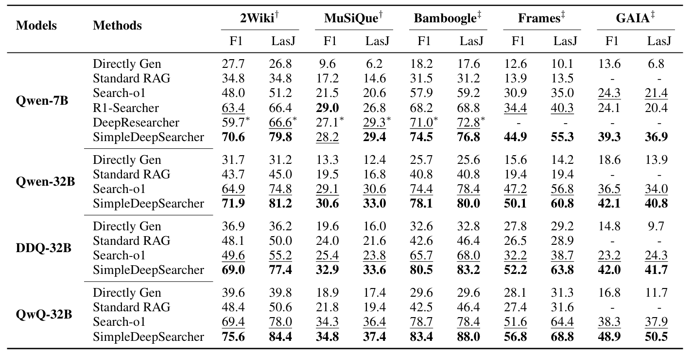
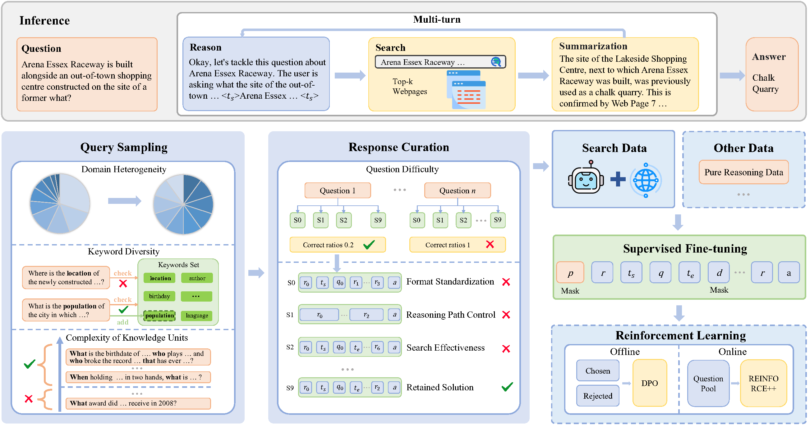

<h1 align="center"> SimpleDeepSearcher: Deep Information Seeking via Web-Powered Reasoning Trajectory Synthesis</a></h1>


<div align="center">
<a href="https://github.com/RUCAIBox/SimpleDeepSearcher/blob/main/LICENSE"></a>
<a href="https://github.com/RUCAIBox/SimpleDeepSearcher/blob/main/LICENSE"></a>
<a href="https://arxiv.org/pdf/2505.16834" target="_blank"></a>
<a href="https://huggingface.co/datasets/RUC-AIBOX/0.8k-data-SimpleDeepSearcher"></a>


</div>

<p align="center">
🤗 <a href="https://huggingface.co/RUC-AIBOX/Qwen-7B-SimpleDeepSearcher" target="_blank">SimpleDeepSearcher-Qwen-7B</a> ｜
🤗 <a href="https://huggingface.co/RUC-AIBOX/Qwen-32B-SimpleDeepSearcher" target="_blank">SimpleDeepSearcher-Qwen-32B</a> ｜
🤗 <a href="https://huggingface.co/RUC-AIBOX/Dpsk-Distilled-Qwen-32B-SimpleDeepSearcher" target="_blank">SimpleDeepSearcher-Dpsk-Distilled-Qwen-32B</a> ｜
🤗 <a href="https://huggingface.co/RUC-AIBOX/QwQ-32B-SimpleDeepSearcher" target="_blank">SimpleDeepSearcher-QwQ-32BB</a>
</p>


<p align="center">
  
</p>


<h5 align="center"> If you like our project, please give us a star ⭐ on GitHub for the latest update.</h5>


# 🚀 News
+ [22 May 2025] ⚡️⚡️ [**R1-Searcher++**](https://github.com/RUCAIBox/R1-Searcher-plus):We propose **R1-Searcher++**,  a framework for training LLMs to adaptively use internal and external knowledge. It uses a two-stage strategy: an initial SFT Cold-start phase for basic format learning, and an RL phase for Dynamic
Knowledge Acquisition. In the RL phase, we introduce a reward mechanism for the utilization of internal knowledge and integrate a memorization mechanism to continuously assimilate the retrieved information, thereby enriching the model's internal knowledge.
The paper can be found here: [**arxiv.org/abs/2505.17005**](https://arxiv.org/abs/2505.17005)
+ [22 May 2025] ⚡️⚡️ [**SimpleDeepSearcher-paper**](https://github.com/RUCAIBox/SimpleDeepSearcher):We release the paper of the SimpleDeepSearcher, which also explores the impact of using a distilled model as the backbone for continued reinforcement learning training, as well as the effects of incorporating long cot math reasoning data during the training process. Additionally, the paper includes comprehensive experiments. The paper can be found here: [**arxiv.org/abs/2505.16834**](https://arxiv.org/abs/2505.16834)
+ [16 Apr 2025] ⚡️⚡️ [**SimpleDeepSearcher**](https://github.com/RUCAIBox/SimpleDeepSearcher):We propose **SimpleDeepSearcher**, a framework designed to stimulate autonomous retrieval during complex reasoning via knowledge distillation and self-distillation. The goal is to achieve efficient and effective training using only a small amount of data.
+ [8 Mar 2025] ⚡️⚡️ [**R1-Searcher**](https://arxiv.org/abs/2503.05592)We propose **R1-searcher**, utilizing a *two-stage outcome-supervision reinforcement learning* approach to enable the model to learn to invoke web search during the reasoning process: first allowing the model to learn how to invoke web search, and then teaching it how to effectively use that search engine. This method does not require any instruction fine-tuning for cold start, and at the same time, it is compatible with existing Base LLMs or Chat LLMs.

# 💡 Overview
SimpleDeepSearcher is a lightweight yet effective framework for enhancing large language models (LLMs) in deep search tasks. Unlike traditional RAG or RL-based methods, SimpleDeepSearcher strategically synthesizes high-quality reasoning trajectories in real-world web environments, enabling supervised fine-tuning (SFT) with only a small amount of curated data. This results in strong performance with significantly reduced computational cost and development complexity.


## 🌟 Key Contributions

- We propose a real web-based data synthesis framework that simulates realistic user search behaviors, generating multi-turn reasoning and search trajectories.

- We design a multi-criteria data curation strategy that jointly optimizes both input question selection and output response filtering through orthogonal filtering dimensions.

- Experimental results demonstrate that SFT on only 871 samples enables SimpleDeepSearcher to outperform strong baselines (especially RL-based baselines) on both in-domain and out-of-domain benchmarks.

## Overall Performance

<p align="center">
  
</p>

- **Superior Performance**: Consistently outperforms all baselines across five benchmark datasets, including both in-domain (2Wiki, MuSiQue) and out-of-domain (Bamboogle, FRAMES, GAIA) settings.

- **Strong Generalization**: Achieves large gains across models with diverse backbones and sizes (7B to 32B), demonstrating the effectiveness of our distillation and self-distillation strategies.

- **High Data Efficiency**: Surpasses RL-based methods using only 871 supervised training examples, showing that our simple framework is both efficient and effective.


## 🧱 Framework Overview

<p align="center">
  
</p>

SimpleDeepSearcher achieves intelligent search through efficient supervised fine-tuning (SFT) using minimal, high-quality training data constructed via a systematic data synthesis and curation pipeline.

- **Data Synthesis in Real Web Environment**: The data synthesis approach is grounded in the real, open web environment, simulating authentic user search behaviors to generate multi-turn reasoning trajectories rather than relying on curated document collections.

- **Diversity-aware Query Sampling**: A diversity-aware query sampling strategy systematically filters open-domain QA resources based on domain heterogeneity, keyword diversity, and knowledge unit complexity to create an informative training foundation aligned with real-world web search.

- **Multi-Dimension Response Curation**: A multi-dimensional response curation process filters synthesized LLM outputs based on format standardization, reasoning path control, question difficulty, and search effectiveness to retain only optimal solutions for training.


# 🏃 Quick Start

## Environment Setup

```bash
# Create conda environment
conda create -n simpds python=3.11
conda activate simpds

# Install requirements
cd SimpleDeepSearcher
pip install -r requirements.txt
```


## Data Construction

### Query Sampling

#### 1. Annotate Domains and Keywords of Labeled Data

```bash
python process_data/query_sampling/data_tag_domain_keypoints.py \
  --input_file_path "/path/to/your/input.json" \
  --cuda_visible_devices "0,1" \
  --model_path "/path/to/your/tag_model"
```

A `_tagged.json` file will be generated in the same path as the input file.


#### 2. Extract Domains and Keywords


```bash
python process_data/query_sampling/extract_domain_keypoints.py \
  --input_file_path "/path/to/your/input_tagged.json" \
  --output_file_path "/path/to/your/output_extracted.json"
```

Convert the annotated domains and keywords into a dictionary.


#### 3. Count Number of Units

```bash
python process_data/query_sampling/units_count.py \
  --input_file "/path/to/your/output_extracted.json"
```

A `_units_count.json` file will be generated in the same path as the input file.

#### 4. Sample Questions

```bash
python process_data/query_sampling/query_sampling.py \
  --input_file "/path/to/your/output_extracted.json" \
  --total_samples YOUR_TOTAL_SAMPLES_NUMBER
```
Parameter Explanation:
- total_samples: `total_samples` is the number of data samples you want to retain.

You will get a new folder named `sampled_query` in the same path as the input file, where `final_selected_dataset.json` is the final sampled questions.

## Data Synthesis in Real Web Environment

### 1. Launch the Summarization Model

```bash
export CUDA_VISIBLE_DEVICES=0,1
vllm serve "YOUR_SUMMARIZATION_MODEL_PATH" \
    --tensor-parallel-size=2 \
    --gpu-memory-utilization 0.95 \
    --port 8000 > output/vllm_serve.log 2>&1 &
```

The summarization model is launched via vllm serve, and subsequent calls to the summarization model are made through the API.

---

### 2. Generate Inference Search Trajectories

```bash
export CUDA_VISIBLE_DEVICES=0,1
python -u inference/sythesis_data.py \
    --dataset_name YOUR_DATASET_NAME \
    --rollout_num YOUR_ROLLOUT_NUM \
    --cache_dir_base cache \
    --output_dir_base output \
    --model_path "/path/to/your/reasoning_model" \
    --summarization_model_path "/path/to/your/summarization_model" \
    --summarization_model_url "http://localhost:8000/v1" \
    --google_subscription_key YOUR_KEY \
    --google_endpoint "https://google.serper.dev/search" > output/output.log  2>&1
```

Parameter Explanation:

- dataset_name: The name of the dataset for which you want to generate web search reasoning trajectories. You need to place the corresponding dataset (json) under the `data` directory.

- rollout_num: The number of reasoning paths (trajectories) to sample per query.

- cache_dir_base: The base directory where intermediate data (i.e., cached web pages, query results) will be stored.

- output_dir_base: The base directory where the final output trajectories will be saved.

- model_path: The path to the reasoning model that will perform multi-step search and reasoning.

- summarization_model_path: The path to the summarization model used to summary retrieved webpages before feeding into the reasoning model.

- summarization_model_url: The endpoint for the VLLM-based summarization model service (must match the port exposed when serving the model).

- google_subscription_key: API key for accessing the Google/Serper.dev search service.

- google_endpoint: The endpoint for the web search API.

You will get folders named `rollout_0` to `rollout_(rollout_num-1)` under the path `output_dir_base/output/dataset_name`, where each `rollout` folder corresponds to one response sampling attempt.


### Response Curation

#### 1. Filter Responses

```bash
python process_data/repsonse_curation/response_curation.py \
  --root_path  "/path/to/your/synthesis_data" \
  --output_path "/path/to/your/curated_data"
```

Parameter Explanation:
- root_path: `root_path` is the `output_dir_base` from the previous data synthesis step.

`output_path/selected_data.json` is the filtered data obtained after selection.

#### 2. Format Data

```bash
python process_data/repsonse_curation/format_data.py \
  --input_file "/path/to/your/input_file.json"
```

The input file `formatted(len(data)).json` in the same directory is the formatted data.


#### 3. Format Check

```bash
python process_data/repsonse_curation/format_filter.py \
  --input_file "/path/to/your/formatted_data.json"
```

You will get a new folder named `filter_process` in the same path as the input file, where `filtered_data_(data_number).json` is the final curated training data after filtering.


---

## SFT Training

> Run the following script after replacing the corresponding variables:

```bash
export OMP_NUM_THREADS=20
export CUDA_VISIBLE_DEVICES=0,1,2,3,4,5,6,7

# Define parameters
lr=1e-5
base="BACKBONE"           # path to base model
tokenizer="TOKENIZER"     # path to tokenizer
train_data="sft/data/training_data_871.json" # path to train data
bsz=2                     # batch size
acc=4                     # gradient accumulation steps

# Create output directory
JOB_ID=$(( RANDOM % 100000 )) # random JOB-ID
JOB_NAME=YOUR_JOB_NAME
output_dir="sft/output/JOB:${JOB_ID}#${JOB_NAME}"
mkdir -p "$output_dir"

echo "output_dir: ${output_dir}"

# Execute deepspeed command
deepspeed \
    --master_port=9944 \
    sft/sft.py \
    --deepspeed sft/ds_zero3_offload.json \
    --model_name_or_path $base \
    --tokenizer_name_or_path $tokenizer \
    --do_train \
    --save_safetensors true \
    --data_path $train_data \
    --lr_scheduler_type cosine \
    --output_dir $output_dir \
    --overwrite_output_dir \
    --warmup_ratio 0.03 \
    --gradient_checkpointing true \
    --per_device_train_batch_size $bsz \
    --gradient_accumulation_steps $acc \
    --logging_steps 1 \
    --learning_rate "$lr" \
    --num_train_epochs 6 \
    --save_strategy epoch \
    --save_only_model true \
    --model_max_length 30000 \
    --save_total_limit 5 \
    --bf16 || exit 1
```


If you want to mix in other data (i.e., data that does not include tool calls), you can run the following script.

```bash
export OMP_NUM_THREADS=20
export CUDA_VISIBLE_DEVICES=0,1,2,3,4,5,6,7

# Define parameters
lr=1e-5
base="BACKBONE"           # path to base model
tokenizer="TOKENIZER"     # path to tokenizer
train_data="sft/data/training_data_871.json" # path to train data
other_type_data="sft/data/other_type_data.json" # path to other type of data
bsz=2                     # batch size
acc=4                     # gradient accumulation steps

# Create output directory
JOB_ID=$(( RANDOM % 100000 )) # random JOB-ID
JOB_NAME=YOUR_JOB_NAME
output_dir="sft/output/JOB:${JOB_ID}#${JOB_NAME}"
mkdir -p "$output_dir"

echo "output_dir: ${output_dir}"

# Execute deepspeed command
deepspeed \
    --master_port=9944 \
    sft/sft.py \
    --deepspeed sft/ds_zero3_offload.json \
    --model_name_or_path $base \
    --tokenizer_name_or_path $tokenizer \
    --do_train \
    --save_safetensors true \
    --data_path $train_data \
    --other_type_data $other_type_data \
    --lr_scheduler_type cosine \
    --output_dir $output_dir \
    --overwrite_output_dir \
    --warmup_ratio 0.03 \
    --gradient_checkpointing true \
    --per_device_train_batch_size $bsz \
    --gradient_accumulation_steps $acc \
    --logging_steps 1 \
    --learning_rate "$lr" \
    --num_train_epochs 6 \
    --save_strategy epoch \
    --save_only_model true \
    --model_max_length 30000 \
    --save_total_limit 5 \
    --bf16 || exit 1
```


### Eval

1. Generate Responses

```bash
export CUDA_VISIBLE_DEVICES=0,1
python -u inference/inference.py \
    --dataset_name YOUR_DATASET_NAME \
    --cache_dir_base cache \
    --output_dir_base output \
    --model_path "/path/to/your/reasoning_model" \
    --summarization_model_path "/path/to/your/summarization_model" \
    --summarization_model_url YOUR_SUMMARIZATION_MODEL_URL \
    --google_subscription_key YOUR_KEY \
    --google_endpoint "https://google.serper.dev/search" > output/output.log  2>&1
```


2. LLM as a Judge

```bash
python eval/gpt_eval.py
```

# 📄 Citation
Please kindly cite our report if they are helpful for your research.

```
@article{sun2025simpledeepsearcher,
  title={SimpleDeepSearcher: Deep Information Seeking via Web-Powered Reasoning Trajectory Synthesis},
  author={Sun, Shuang and Song, Huatong and Wang, Yuhao and Ren, Ruiyang and Jiang, Jinhao and Zhang, Junjie and Bai, Fei and Deng, Jia and Zhao, Wayne Xin and Liu, Zheng and others},
  journal={arXiv preprint arXiv:2505.16834},
  year={2025}
}
```

# 📄 License

This project is released under the [MIT License](LICENSE).

# 📞 Contact

For any questions or feedback, please reach out to us at [sunshuanguns@gmail.com](sunshuanguns@gmail.com) or [songhuatong123@ruc.edu.cn](songhuatong123@ruc.edu.cn).
Minor documentation update.
