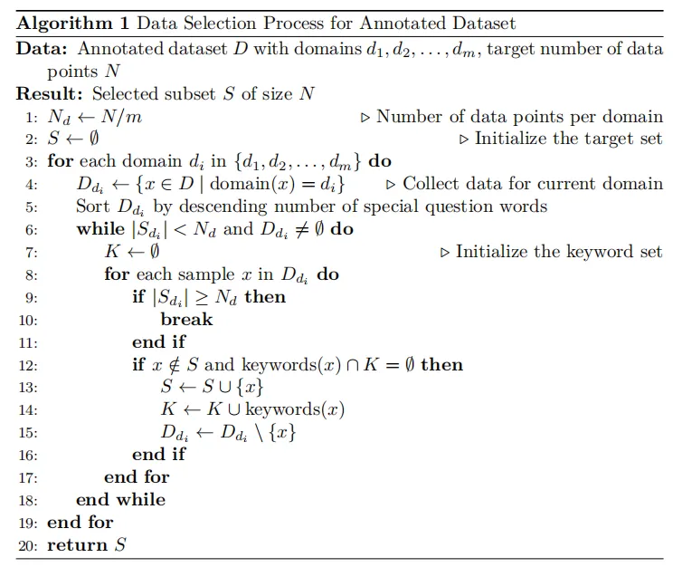
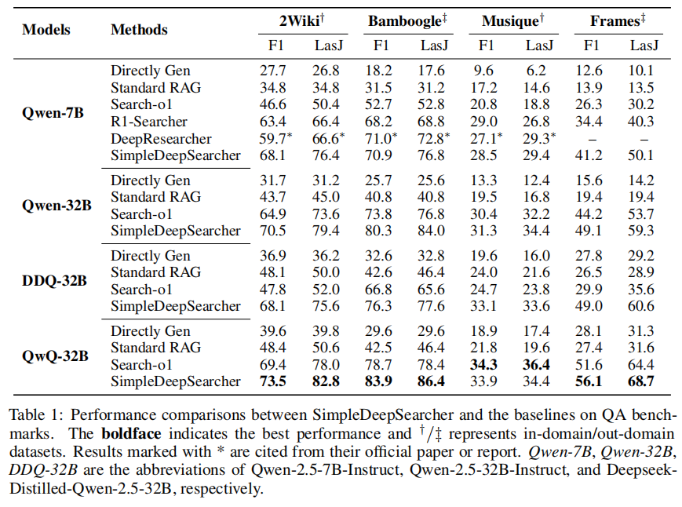
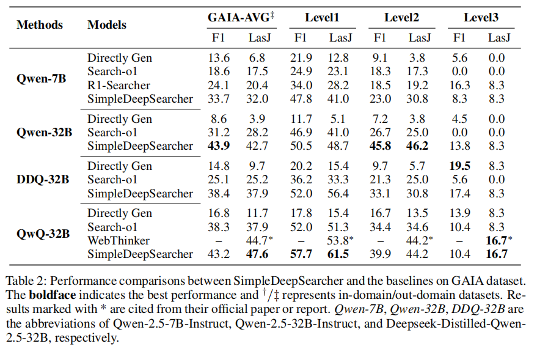
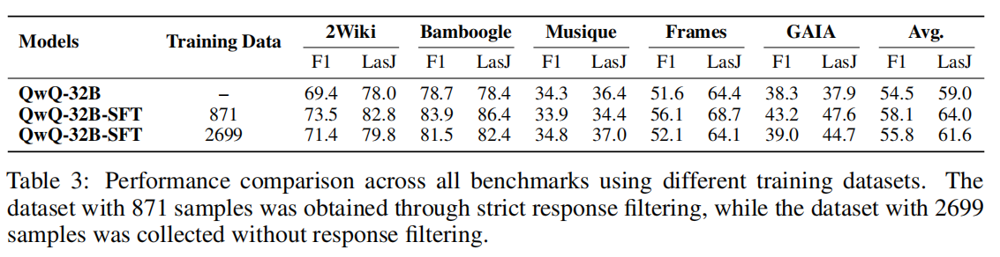
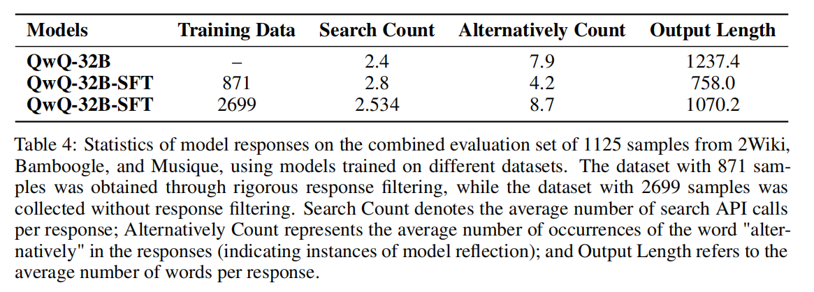
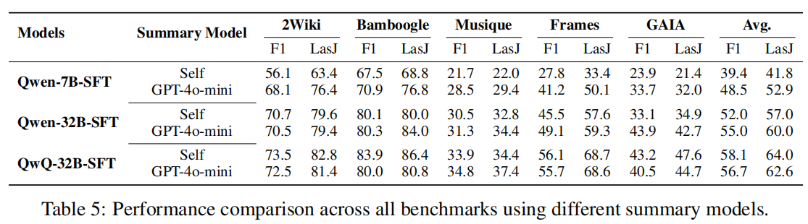
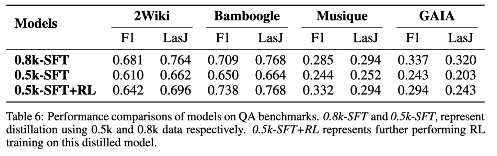
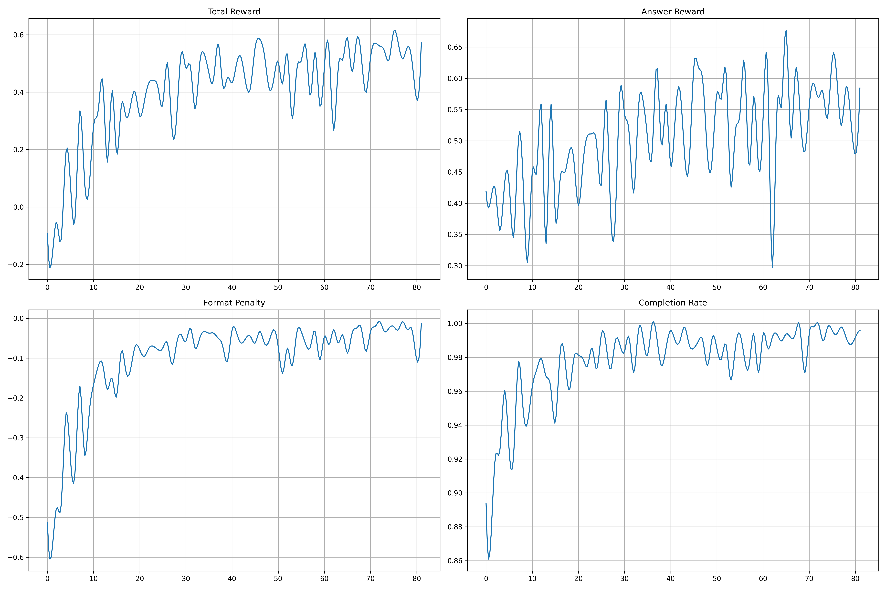
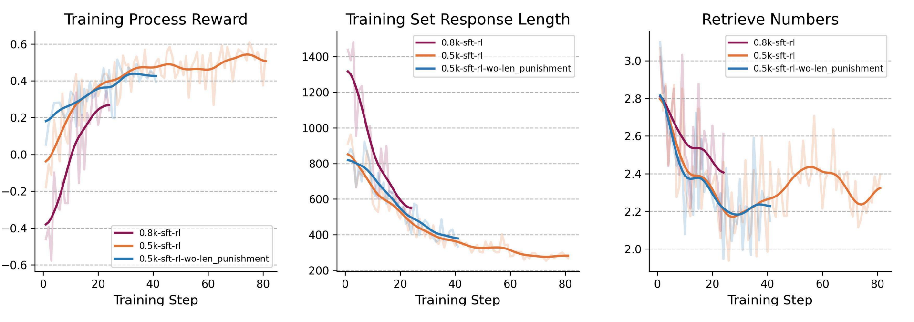

<h1 align="center"> SimpleDeepSearcher: Deep Information Seeking via Web-Powered Reasoning Trajectory Synthesis</a></h1>


<div align="center">
<a href="https://github.com/RUCAIBox/SimpleDeepSearcher/blob/main/LICENSE"></a>
<a href="https://github.com/RUCAIBox/SimpleDeepSearcher/blob/main/LICENSE"></a>
<a href="https://huggingface.co/XXsongLALA"></a>
<a href="https://arxiv.org/pdf/2503.05592" target="_blank"></a>

</div>


<p align="center">
  
</p>


<h5 align="center"> If you like our project, please give us a star ⭐ on GitHub for the latest update.</h5>


# 💡 Overview

<p align="center">
  
  
</p>

Recently, researchers begin to explore methods for enhancing LLMs’ complex reasoning capabilities in information retrieval tasks. These approaches typically leverage reinforcement learning to stimulate autonomous retrieval during the reasoning process. Notably, such methods require only the raw questions as input, without the need for high-quality answer supervision. While effective in improving model performance, reinforcement learning incurs substantial training overhead. Moreover, many current approaches rely on local retrieval databases; transitioning to web-based search systems further reduces training efficiency. Additionally, methods employing online search often demand significant computational resources, hindering the broader adoption of complex reasoning-based retrieval systems. This motivates the need for a solution that enables powerful reasoning with minimal training cost.

**To this end, we propose *SimpleDeepSearcher*, a framework designed to stimulate autonomous retrieval during complex reasoning via knowledge distillation and self-distillation. The goal is to achieve efficient and effective training using only a small amount of data**. Despite its conceptual simplicity, constructing high-quality training data presents two key challenges. On the query side, existing open-source datasets often suffer from issues such as imbalanced topic distributions, repetitive structures, and insufficient complexity, limiting their utility in eliciting deep retrieval behavior. On the response side, solving deep retrieval tasks requires effectively decomposing complex queries while avoiding invalid reasoning steps and overthinking—objectives that are fundamentally distinct from those in traditional mathematical or logical reasoning tasks.

To address these challenges, we first perform fine-grained filtering of existing open-source datasets based on multiple dimensions including domain coverage, structural variety, and question complexity. This ensures that the selected queries exhibit diverse domains and structures, as well as a balanced difficulty distribution. Next, we perform rollout sampling using large reasoning models in a real-world retrieval environment. The resulting traces are then filtered again based on criteria such as format, subquery quality, question difficulty, and reasoning path integrity, in order to eliminate redundant reasoning. The curated data is subsequently used to train multiple models, enabling us to explore the potential of distillation techniques in fostering autonomous retrieval capabilities.

**We evaluate our proposed method on five challenging benchmarks—2WikiMultiHopQA, Bamboogle, Musique, FRAMES, and GAIA—and our results demonstrate that *SimpleDeepSearcher* consistently outperforms a range of recent state-of-the-art baselines.**

**We release all training and inference code, along with model checkpoints. Additionally, we provide two highly efficient supervised fine-tuning datasets of 0.5k and 0.8k examples. The 0.5k dataset features more direct reasoning paths, while the 0.8k dataset includes richer reflection and rethinking processes. A detailed technical report will be released in the near future.**

- **Models**:
    - Qwen-7B-SimpleDeepSearcher: https://huggingface.co/RUC-AIBOX/Qwen-7B-SimpleDeepSearcher
    - Qwen-32B-SimpleDeepSearcher: https://huggingface.co/RUC-AIBOX/Qwen-32B-SimpleDeepSearcher
    - Dpsk-Distilled-Qwen-32B-SimpleDeepSearcher: [https://huggingface.co/RUC-AIBOX/Dpsk-Distilled-Qwen-32B-SimpleDeepSearche](https://huggingface.co/RUC-AIBOX/Dpsk-Distilled-Qwen-32B-SimpleDeepSearcher)
    - QwQ-32B-SimpleDeepSearcher: https://huggingface.co/RUC-AIBOX/QwQ-32B-SimpleDeepSearcher
- **Training Data**:
    - 0.5k: https://huggingface.co/datasets/RUC-AIBOX/0.5k-data-SimpleDeepSearcher
    - 0.8k: https://huggingface.co/datasets/RUC-AIBOX/0.8k-data-SimpleDeepSearcher
- **GitHub**: [https://github.com/RUCAIBox/SimpleDeepSearcher](https://github.com/RUCAIBox/CyberSearcher)
- **Notion**: [https://sweet-walkover-f9b.notion.site/SimpleDeepSearcher-Deep-Information-Seeking-via-Web-Powered-Reasoning-Trajectory-Synthesis-1d1c27a43d7a801090d8ce1a75b2d6d0?pvs=4](https://sweet-walkover-f9b.notion.site/SimpleDeepSearcher-Deep-Information-Seeking-via-Web-Powered-Reasoning-Trajectory-Synthesis-1d1c27a43d7a801090d8ce1a75b2d6d0?pvs=4)

# ✨ Key Insights
1. **Data Synthesis Based on Real-World Web Environments**: We design a large-scale data synthesis pipeline grounded in authentic open-web environments, enhancing the diversity and realism of training corpora. This significantly improves the model’s ability to retrieve and integrate information in complex search tasks.
2. **Rigorous Data Filtering Strategy**: We introduce a task-specific QA pair filtering method tailored for search-oriented training, enabling fine-grained selection of high-quality training samples.
3. **Efficient Performance Boost with Limited Data**: Using only 871 distilled examples, our 7B-scale model surpasses existing models trained via reinforcement learning. Notably, Qwen-32B-Instruct approaches the performance of QwQ-32B, which possesses built-in retrieval capabilities, while also enabling further performance gains for QwQ-32B itself.
4. **Generalization to OOD Evaluation Sets**: Training on conventional multi-hop datasets leads to strong generalization capabilities on out-of-distribution (OOD) benchmarks, including FRAMES and GAIA.
5. **Analysis of Post-Distillation Reinforcement Learning**: We further finetune the distilled 7B model with reinforcement learning and provide an in-depth analysis of the training dynamics and performance impact.

# ✨ Methodology and Technical Framework
## Data Synthesis
**In contrast to traditional Retrieval-Augmented Generation (RAG) systems that rely on closed and static knowledge bases, our approach situates the retrieval and generation process within the open and dynamic environment of the real-world internet.** This setting is designed to enhance the model's capability for information awareness and integration in authentic search scenarios.

Specifically, instead of utilizing a controlled and curated document collection, our system operates within the open web—an inherently noisy, diverse, and constantly evolving information space. Web content varies widely in format (e.g., encyclopedic entries, forums, news articles, advertisements), quality, and structure, often consisting of unstructured text and heterogeneous linguistic styles. Such a complex environment more accurately reflects real-world user conditions and imposes greater demands on the model's ability to extract, synthesize, and reason over information.

Against this backdrop, we develop an automated data synthesis pipeline based on the popular "web search – content filtering – information summarization – answer synthesis" framework. Leveraging a strong reasoning model (QwQ-32B), we conduct large-scale rollouts in the real web environment: for each curated question, the model generates multiple high-quality answers grounded in search engine results. This process requires the model not only to construct precise and relevant subqueries, but also to identify and extract salient information from noisy, redundant, or even contradictory web sources, thereby producing accurate, concise, and well-structured outputs.

Through this method of data synthesis grounded in real-world web contexts, we significantly improve the diversity and authenticity of training samples. This, in turn, provides more practically aligned supervision signals for fine-tuning, and offers a novel pathway for enhancing the retrieval capabilities of large language models in open-domain question answering tasks.

## Data Source Selection and Filtering
We selected a combination of single-hop and multi-hop datasets, including *Natural Questions*, *HotpotQA*, *2WikiMultihopQA*, *Musique*, *SimpleQA*, and *MultiHop-RAG*. These datasets provide a rich variety of query types, ensuring broad coverage across training data.

To ensure the quality and diversity of the training samples, we developed a fine-grained filtering methodology for both questions and responses. Specifically:

**1. Question Filtering**

**Filtering criteria include:**

- **Domain Diversity**: Ensuring that questions span across a wide range of knowledge domains.
- **Keyword Diversity**: Keywords refer to the key entities, attributes, and relations mentioned in the question. This helps reduce redundancy and enhances the diversity of question patterns.
- **Coverage of Specific Interrogative Words**: Increasing the complexity of the questions by emphasizing the use of varied interrogative terms.

We utilized QwQ-32B to annotate each question with its domain and extracted keywords. The number of specific interrogative words in each question was also quantified. The detailed question filtering procedure is illustrated in following Figure:


<p align="center">
  
</p>

**2. Response Filtering**

We impose strict constraints on both the format and content of generated responses, retaining only those that satisfy all predefined criteria.

**Filtering criteria include:**

- **Format compliance:** Responses exhibiting mixed Chinese-English usage or malformed special formatting are discarded to ensure consistency and clarity.
- **Sub-query validity:** We prioritize responses containing fewer redundant retrievals and lower content overlap between sub-queries, thereby improving overall retrieval efficiency.
- **Question difficulty:** We deliberately select questions with a low correct response rate across multiple rollout trials to enhance the model’s ability to handle complex queries.
- **Reasoning path control:** We enforce tight restrictions on the use of reflective expressions (e.g., *alternatively*, *wait*, etc.) and limit single-pass reasoning length to avoid ineffective or irrelevant reasoning chains.

For the selected open-source dataset, we first apply the proposed question filtering algorithm to identify questions. This process yields a collection of questions that are rich in domain variety, diverse in patterns, and high in complexity. Subsequently, based on the data synthesis strategy designed to mimic real-world internet environments, we use the QwQ-32B model to conduct large-scale rollouts for each selected question, generating multiple candidate responses. Finally, we apply the above filtering criteria to rigorously select high-quality responses from the candidate pool. Through this multi-stage process, we construct a dataset comprising 871 high-quality question-response pairs.

# 📄 Evaluation
## Seettings
- **Benchmarks**: We evaluate our model on five benchmarks: *2WikiMultiHopQA*, *Bamboogle*, *Musique*, *FRAMES*, and *GAIA*. Among them, *2WikiMultiHopQA* and *Musique* are considered in-domain datasets, as their training sets were used during model development. In contrast, *Bamboogle*, *FRAMES*, and *GAIA* are treated as out-of-domain datasets. Notably, *FRAMES* is designed to assess factual consistency, retrieval accuracy, and reasoning capability, while *GAIA* focuses on the model’s ability to solve complex real-world problems. We adopt the benchmark settings from [R1-Searcher](https://arxiv.org/pdf/2503.05592) for *2WikiMultiHopQA*, *Bamboogle*, and *Musique*. For *FRAMES*, we utilize the full test set, and for *GAIA*, we adopt the same evaluation subset as selected in [**WebThinker**](https://github.com/RUC-NLPIR/WebThinker).
- **Evaluation Metrics**: We use both F1 score and LLM-as-Judge (LasJ) as evaluation metrics. For LLM-as-Judge, judgments for *2WikiMultiHopQA*, *Bamboogle*, *Musique*, and *FRAMES* are made using GPT-4o-mini, while *GAIA* is evaluated using Qwen2.5-72B-Instruct (aligned with [WebThinker](https://github.com/RUC-NLPIR/WebThinker)).
- **Backbones**: The models used as backbones include Qwen-2.5-7B-Instruct, Qwen-2.5-32B-Instruct, Deepseek-Distilled-Qwen-2.5-32B, and QwQ-32B. These cover models of different sizes and inference models.
- **Baselines**: We compare our approach against several baselines: *Direct Generation*, *Standard RAG*, *Search-o1*, *R1-Searcher*, *DeepResearcher*, and *WebThinker*. For *Standard RAG*, we employ the 2019 Wikipedia dump provided by KILT as the local dense retrieval corpus. This choice is motivated by the complexity of the queries, which makes effective retrieval via real-time web search challenging. All other retrieval-based methods use Google Search API for online document retrieval.
- **Training Details**: Supervised fine-tuning is performed on 871 rigorously curated examples using Qwen2.5-7B-Instruct, Qwen2.5-32B-Instruct, DeepSeek-R1-Distill-Qwen-32B, and QwQ-32B. During fine-tuning, external retrieval documents are masked to avoid learning from noisy or spurious information.

## Main Results


<p align="center">
  
</p>
<p align="center">
  
</p>

- **Significant Overall Performance Gains**: Compared with existing baseline approaches such as Directly Gen, Standard RAG, and Search-o1, SimpleDeepSearcher demonstrates a clear performance advantage across all five QA benchmarks.
- **Maintaining Generalization Ability**: Among the evaluated benchmarks, 2WikiMultihopQA and Musique serve as in-domain datasets, while Bamboogle, Frames, and GAIA represent out-of-domain scenarios. Our method achieves superior generalization, particularly on the more challenging Frames and GAIA datasets, significantly outperforming other existing methods. These results highlight the robustness and strong generalization capability of the trained model.
- **Consistent Improvements Across Model Scales**: SimpleDeepSearcher consistently improves performance across a range of model sizes, including both smaller models such as Qwen2.5-7B-Instruct and larger models like Qwen2.5-32B-Instruct, DeepSeek-R1-Distill-Qwen-7B, and QwQ-32B. This suggests that our proposed framework of distillation and self-distillation generalizes effectively across different model capacities.
- **Enhanced Retrieval Efficiency and Reasoning Compactness**: The trained models exhibit more efficient search invocation and streamlined reasoning processes. SimpleDeepSearcher not only improves the model's ability to decompose complex queries and generate precise and effective sub-queries, but also significantly reduces redundant inference. The resulting decision pathways are more concise, transparent, and coherent.

# 🌟 Analysis of Supervised Fine-Tuning (SFT)
## Impact of Data Filtering
We first compare the performance of the QwQ-32B model trained on a strictly filtered dataset of 871 samples against a model trained on a larger but unfiltered dataset of 2,699 samples. The experimental results indicate the following:

- The model trained on the strictly filtered 871 samples consistently outperforms the one trained on the unfiltered 2,699 samples, suggesting that high-quality data has a more pronounced effect in enhancing the model’s generalization capabilities.
- Compared to the model trained on the unfiltered data, the one trained on the strictly filtered dataset exhibits a higher average number of search steps, but significantly fewer occurrences of alternative reasoning paths and shorter response lengths. This indicates that the filtered data is more effective in prompting the model to decompose complex queries efficiently while avoiding unnecessary reasoning steps and overthinking.


<p align="center">
  
</p>

<p align="center">
  
</p>


## Impact of Webpage Summarization Models
Since retrieved webpage content is often lengthy and contains substantial noise, directly inputting such content into the model for reasoning can easily exceed the context window and introduce irrelevant information that impairs reasoning performance. Therefore, it is necessary to summarize and condense the webpage content beforehand. We conducted a comparative analysis between using the model's own summarization capabilities and employing GPT-4o-mini as an external summarization model. Experimental findings demonstrate that the choice of summarization model has a significant impact on downstream performance. For the SFT-tuned Qwen-7B-Instruct model, using GPT-4o-mini as the summarizer consistently outperforms the model's own summaries across all datasets, yielding an average improvement of approximately 10 percentage points. A similar trend is observed for SFT-tuned Qwen-32B-Instruct on all datasets except 2Wiki. In contrast, for the SFT-tuned QwQ-32B model, self-generated summaries result in better performance.
<p align="center">
  
</p>

# 🌟 Continued RL Training Based on a 7B-SFT Model
## Settings
1. **SFT Dataset:** It is worth noting that despite our efforts to limit the frequency of analytical discourse markers (e.g., Alternatively, Wait, Hmm) in the distilled data, the 7B model still exhibited repetitive generation and overthinking tendencies after distillation. These behaviors led to slower convergence during reinforcement learning. To address this, we performed a second round of data filtering on the original 0.8k dataset and removed samples containing the term "Alternatively", resulting in a 0.5k subset used for supervised fine-tuning (SFT) and subsequent distillation. While this reduction may lead to a slight degradation in reasoning ability, we are currently training an RL model based on the full 0.8k dataset. For updates, please refer to this [repository](https://github.com/RUCAIBox/SimpleDeepSearcher).
2. **RL Dataset:** The SFT-tuned model was used to perform rollout sampling on the training sets of 2Wiki and HotpotQA. For each question, 8 rollouts were generated. We selected 2,480 samples from those questions with 1 to 6 correct answers to construct the RL training dataset.
3. **Reward Model:** Our reward function consists of two components: an answer reward and a format penalty.
    - The answer reward is computed as the F1 score between the predicted answer and the reference answer.
    - The format penalty is a discrete penalty of -2 applied if any of the following conditions are met (0 otherwise):
        1. **Self-Retrieved Content:** The model fabricates external documents.
        2. **Contains Gibberish:** The output contains nonsensical or corrupted text.
        3. **Too Many Analytical Terms:** More than 5 instances of analytical markers such as Alternatively, Wait, or Hmm are present.
        4. **No Boxed Answers:** The model performs more than 8 retrieval steps, or the analytical content between two retrievals exceeds 8,096 tokens.
## Evaluation
As shown in the table below, models distilled with the 0.5k dataset underperform those using the 0.8k dataset in terms of baseline reasoning ability. However, reinforcement learning significantly boosts performance in both cases, demonstrating its capacity to enhance the model’s autonomous retrieval abilities. RL training for the model distilled with the full 0.8k dataset is ongoing. Please refer to our repository for further updates.
<p align="center">
  
</p>

## Analysis
### Continuous Increase in Completion Rate and Reward, Gradual Decrease in Format Penalty
As shown in the figure below, all format penalties gradually decrease as training progresses, while both answer reward and total reward exhibit an overall upward trend. The completion rate also increases correspondingly. These results indicate that reinforcement learning is effective in enhancing the model's ability to generate responses with higher accuracy while adhering to the required formatting standards.

<p align="center">
  
</p>

<p align="center">
  
</p>

### Significant Reduction in Response Length and Slight Decrease in Retrieval Frequency
As illustrated in the figure below, 0.8k-sft-rl refers to the model fine-tuned with 0.8k instances via supervised fine-tuning (SFT) as the backbone for reinforcement learning (RL); 0.5k-sft-rl uses a backbone trained with 0.5k SFT instances; 0.5k-sft-rl-no-len-punishment shares the same backbone as 0.5k-sft-rl but removes the “Too Many Analytical Terms” penalty during RL.

Several observations can be made:

1. Models trained with 0.8k-sft as the RL backbone generally receive lower rewards. This is primarily due to the fact that, despite explicit constraints on the number of analytical terms in the distilled data, the 7B model still exhibits overthinking tendencies post-distillation, often triggering the “Too Many Analytical Terms” penalty and incurring format-related deductions.
2. Regardless of whether the reward model incorporates the “Too Many Analytical Terms” penalty, the overall trend shows a consistent reduction in response length. This suggests that reinforcement learning effectively guides the model to produce more concise and precise answers. However, this gain in succinctness may come at the expense of the distilled model's original reasoning capabilities.

<p align="center">
  
</p>

# 🏃 Quick Start
Coming Soon...


# 📄 Citation
Please kindly cite our report if they are helpful for your research.

```
@article{SimpleDeepSearcher,
  title={SimpleDeepSearcher: Deep Information Seeking via Web-Powered Reasoning Trajectory Synthesis},
  author={Shuang Sun*, Huatong Song*, Yuhao Wang, Ruiyang Ren, Jinhao Jiang, Junjie Zhang, Lei Fang, Zhongyuan Wang, Wayne Xin Zhao, Ji-Rong Wen},
  url={https://github.com/RUCAIBox/SimpleDeepSearcher},
  year={2025}
}
```

# 📄 License

This project is released under the [MIT License](LICENSE).

# 📞 Contact

For any questions or feedback, please reach out to us at [sunshuanguns@gmail.com](sunshuanguns@gmail.com) or [songhuatong123@ruc.edu.cn](songhuatong123@ruc.edu.cn).
